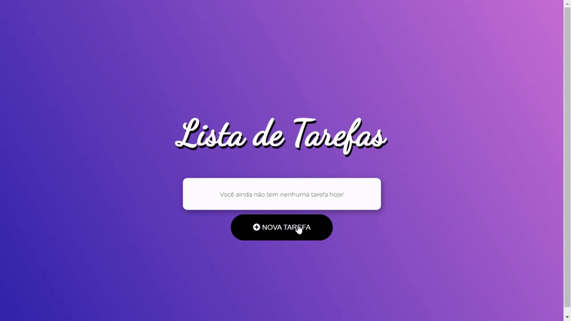

<h1>Balta.io</h1>
<h2>Começando com Angular</h2>

Este é o curso para quem deseja começar a desenvolver Frontends com Angular.

O curso aborda todos os conceitos fundamentais do Angular e, aprendendo os conceitos fundamentais, você poderá utilizá-los em todas as versões mais recentes do Framework.

Começaremos do começo, preparando seu computador para trabalhar com Angular e criando seu primeiro projeto da maneira correta. Este curso é totalmente prático.

Vem comigo nesta jornada para adicionar Angular ao seu cinturão de utilidades!

<h3>Tecnologias Utilizadas</h3>

-  [Jasmine](http://jasmine.github.io/) – Javascript Testing Framework
-  [Node.js](http://nodejs.org/) – Frameworks (Full Stack)
-  [JavaScript](https://developer.mozilla.org/en-US/docs/Web/JavaScript) – Languages
-  [Karma](http://karma-runner.github.io/) – Browser Testing
-  [TypeScript](http://www.typescriptlang.org) – Languages
-  [RxJS](http://reactivex.io/rxjs/) – Concurrency Frameworks
-  [Angular](https://angular.io) – Javascript MVC Frameworks
-  [Vite](https://vitejs.dev/) – JS Build Tools / JS Task Runners

Para ver todas as tecnologias [clique aqui](/techstack.md)

<h3>Projeto do curso</h3>

Criaremos uma aplicação de lista de tarefas (Todo App) com Angular onde serão apresentados os conceitos fundamentais do Angular, como componentes, módulos, formulários, validações, bindings.

<strong>Link do projeto:</strong> <a href="https://edijunior88.github.io/Balta.io_Comecando_com_Angular/">https://edijunior88.github.io/Balta.io_Comecando_com_Angular/</a>

 <ul>
   <li>Apresentação</li>
   <li>Ferramentas</li>
   <li>Criando um projeto</li>
   <li>Entendendo o projeto</li>
   <li>Módulos e Componentes</li>
   <li>Rodando a aplicação</li>
   <li>Variáveis e Tipos</li>
   <li>Exibindo Dados</li>
   <li>Objetos Complexos</li>
   <li>ngIf</li>
   <li>Removendo um Item</li>
   <li>Alterando um Item</li>
   <li>Forms Básico</li>
   <li>Exibindo as Validações</li>
   <li>Desabilitando o Botão</li>
   <li>Adicionando uma Tarefa</li>
   <li>Salvando os Itens</li>
   <li>Lendo os Itens</li>
   <li>Estilizando o Corpo da Página</li>
   <li>Estilizando os Itens</li>
   <li>Estilizando o Botão</li>
   <li>Alternando as Visualizações</li>
   <li>Estilizando o Formulário</li>
   <li>Estilizando as Ações da Lista</li>
   <li>Build e Toques Finais</li>
 </ul>

<h4><b>Aulas:</b> 📼 25 video-aulas</h4>
<h4><b>Status do Curso:</b> ✅ Concluído</h4>
